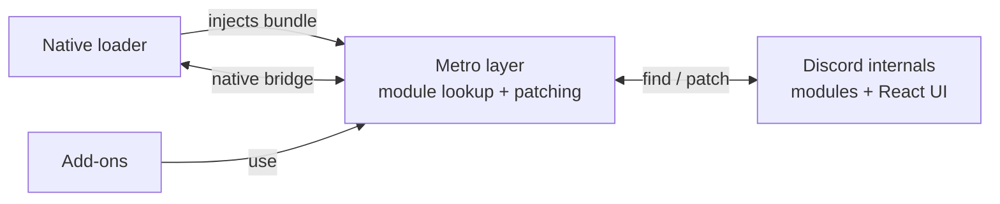

<div align="center">


<h1>Unbound</h1>

### A client modification for Discord on mobile.

Install plugins, themes, fonts, and icon packs on the official Discord app, on both iOS and Android.

<br />

[](https://github.com/marioparaschiv/unbound/stargazers)
[](https://github.com/marioparaschiv/unbound/releases)
[](https://discord.gg/unbound)
[](./LICENSE)

**[Documentation](https://docs.unbound.rip)** · [Contributing](./CONTRIBUTING.md)

</div>

<!-- TODO: add a hero screenshot or demo GIF of Unbound running here (drop assets into ./assets and reference them). -->

---

## Contents

- [What Is Unbound?](#what-is-unbound)
- [Features](#features)
- [Installation](#installation)
- [Creating Add-ons](#creating-add-ons)
- [Architecture](#architecture)
- [Getting Started](#getting-started)
- [Contributing](#contributing)
- [Acknowledgements](#acknowledgements)
- [Star History](#star-history)
- [License](#license)

---

## What Is Unbound?

Unbound is a client modification for the official Discord mobile app. It loads inside Discord and wraps the app's internals in a stable API, so you can install plugins, themes, fonts, and icon packs without patching Discord by hand.

Running inside Discord gives add-ons direct access to the same modules, state, and UI the app itself uses. Unbound builds on that with tools for patching Discord's internals, both its behavior and its React components, so add-ons can change how the app works and how it looks. All of it is reversible: add-ons run behind error boundaries and can be torn down completely, so disabling one returns Discord to stock. That is what makes hot-reloading safe.

Unbound runs on both iOS and Android through a single native bridge, so the client behaves the same on each without platform-specific code paths. iOS is the primary target; Android is supported.

This repository holds the client source. The native loaders that install Unbound onto a device live in separate repositories. To install it, see the sections below.

---

## Features

- **Add-ons:** plugins, themes, fonts, and icon packs on top of the stock Discord app.
- **Safe hot-reloading:** add-ons update at runtime without restarting Discord.
- **Error isolation:** a broken add-on is caught and recorded instead of crashing the app.
- **Recovery mode:** a reliable path back to a stock Discord when something goes wrong.
- **Cross-platform:** native iOS and Android through a single bridge, with matching behavior.
- **Typed SDK:** `@unbound-app/api` gives autocomplete across the entire client API.

---

## Installation

Follow the loader docs for your platform:

- **iOS:** [docs.unbound.rip/loader/ios](https://docs.unbound.rip/loader/ios)
- **Android:** [docs.unbound.rip/loader/android](https://docs.unbound.rip/loader/android)

If you're new to loaders, start with the [loader introduction](https://docs.unbound.rip/loader/introduction).

---

## Creating Add-ons

Every add-on uses the same [manifest format](https://docs.unbound.rip/addons/manifest) and declares a `type` that tells the client how to load it:

- **Plugins** change how Discord behaves, through commands, UI, and patches. They're written against the typed [`@unbound-app/api`](packages/api) SDK and have a `start()` / `stop()` lifecycle that the client runs for you.
- **Themes** override colors and can set custom backgrounds.
- **Fonts** register custom font families natively.
- **Icon packs** replace Discord's built-in assets.

Scaffold a new add-on with the CLI:

```bash
bunx @unbound-app/cli create
```

Installing `@unbound-app/api` gives you typed access to the client API (`unbound.metro`, `unbound.storage`, `unbound.toasts`, and the rest), with autocomplete for everything it exposes. The [add-on documentation](https://docs.unbound.rip/addons/introduction) covers the manifest, the lifecycle, the SDK, and publishing.

---

## Architecture

A platform-specific native loader patches Discord to get JavaScript execution, then injects the client bundle. On boot the client traps Discord's Metro registry (`__r`/`__d`) and wraps every module factory, which gives it a searchable view of Discord's internal modules. Add-ons look modules up through that Metro layer (`findByProps`, `findByName`, `findStore`) and patch them, both plain functions and React components, using [possess](https://www.npmjs.com/package/possess).

The native side is bidirectional. The client calls into the loader for native capabilities (reload, filesystem, `evaluateBytecode`), while inbound native calls that arrive before the client is ready are queued during init and replayed once it finishes.



The client is the runtime that ships into Discord. Everything else is a small package that supports it.

| Package                                  | What it is                                                                                    |
| ---------------------------------------- | --------------------------------------------------------------------------------------------- |
| [`packages/client`](packages/client)     | The Unbound runtime, the bundle that ships into Discord.                                       |
| [`packages/cli`](packages/cli)           | The `ubd` CLI for scaffolding and managing add-on projects.                                    |
| [`packages/debugger`](packages/debugger) | A REPL/CLI that connects to a running client to eval code, stream logs, and push add-on bundles. |
| [`packages/api`](packages/api)           | Public type declarations that add-on developers build against.                                 |
| [`packages/logger`](packages/logger)     | A small, dependency-free scoped logger with ANSI colors.                                       |
| [`packages/utils`](packages/utils)       | Per-file utilities, each imported individually for tree-shaking.                               |
| [`packages/types`](packages/types)       | Shared TypeScript types used across the project.                                               |

The client runs on a single `initialize` / `shutdown` lifecycle. Each manager brings its add-ons up on startup and tears them down on shutdown, and settings are persisted before the global is cleared.

---

## Getting Started

You'll need [Bun](https://bun.sh) and an existing Unbound installation on a device or emulator to load your bundle into.

```bash
git clone https://github.com/marioparaschiv/unbound
cd unbound

bun install        # install workspace dependencies
bun run build      # build the bundle once
bun run dev        # or rebuild automatically on every change
```

These scripts live in `packages/client`. Run them from that directory, or from the repo root by prefixing them with `bun --filter @unbound-app/client run`.

To test your bundle, serve it over the local network, then point your Unbound installation's custom bundle URL at your machine and restart Discord (see the [docs](https://docs.unbound.rip/loader/local-build) for the exact steps):

```bash
bun serve [PORT]   # serves ./dist
```

Repo-wide checks from the root:

```bash
bun run lint       # oxlint
bun run fmt        # oxfmt (write); fmt:check to verify
```

---

## Contributing

Contributions are welcome. Before opening a PR, read the [contribution guide](./CONTRIBUTING.md), since formatting and lint rules are enforced. Keep PRs focused, write clear commit messages, make sure the project builds, and stay current with `main`.

---

## Acknowledgements

Unbound wouldn't exist without the work of:

- [@acquitelol](https://github.com/acquitelol) for the bundle, the debugger, and several ideas.
- [@castdrian](https://github.com/castdrian) for the iOS loader, vbound, autosupport, the automatic decryption service, and build automation / CI pipelines.
- [@NotZoeyDev](https://github.com/NotZoeyDev) for [Enmity](https://github.com/enmity-mod), and for paving the way for client modifications on iOS and mobile in general.
- [@rushiiMachine](https://github.com/rushiiMachine) for [libunbound-android](https://github.com/unbound-app/libunbound-android).

<div align="center">

<a href="https://github.com/marioparaschiv/unbound/graphs/contributors">
	
</a>

</div>

---

## Star History

<div align="center">

<a href="https://star-history.com/#marioparaschiv/unbound&Date">
	
</a>

</div>

---

## License

Unbound is licensed under the [GNU General Public License v3.0](./LICENSE).
